<h1>
Touchtris

</h1>

<h4>
  ·
  <a href="(https://github.com/Mitchlol/Touchtris/raw/refs/heads/main/app/release/app-release.apk)">Android APK Link</a>
  ·

</h4>

A tetris clone with a twist, instead of pieces falling, they timeout, and appear in place. The buttons operate like a state machine. Instead of tucks and spins, pieces will always fall though others to the lowest open space they fit in.

Designed to help memorize the precise number of taps needed to place any piece in any position. 

Built as a chance to mess with compose.

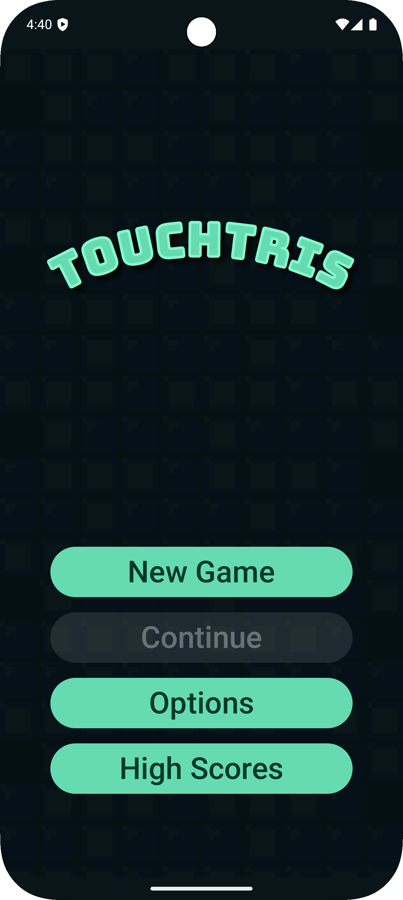
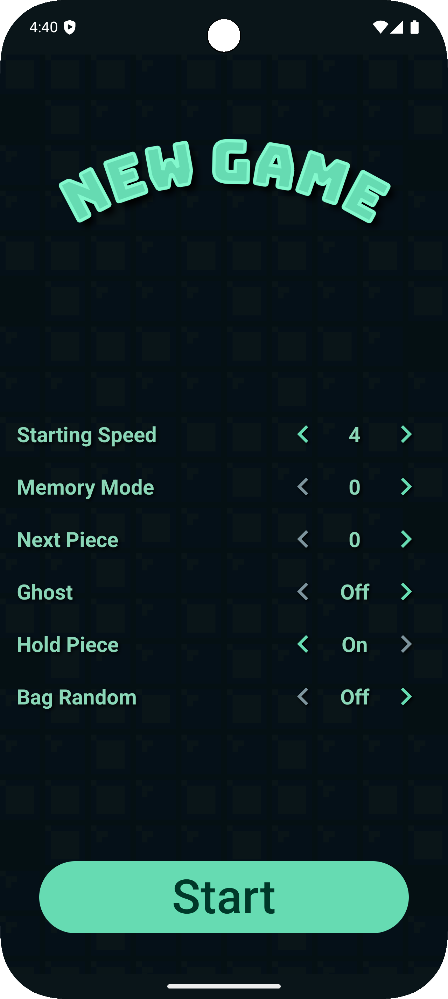
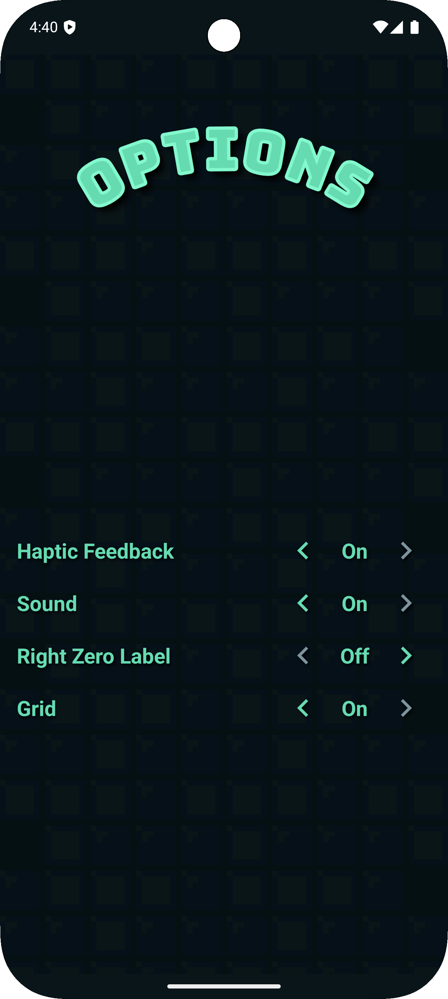
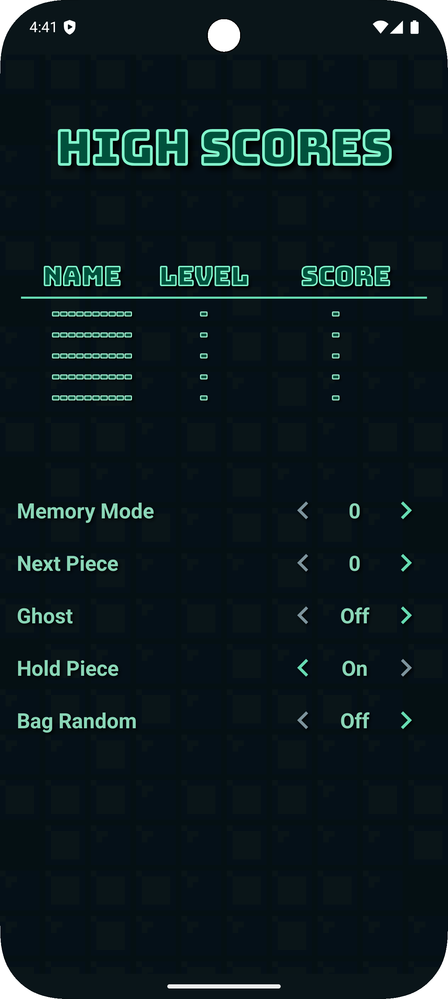
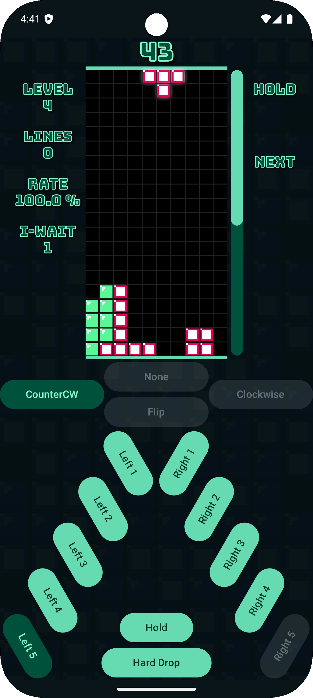
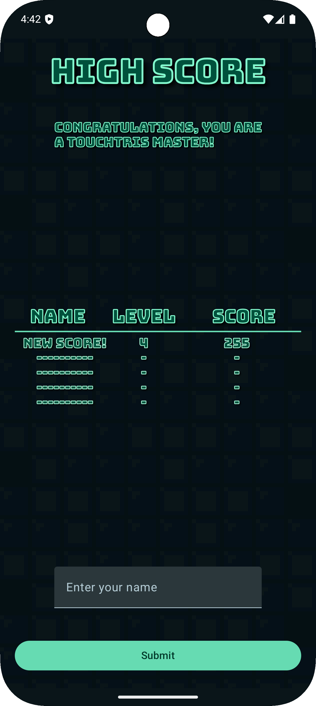

App uses system wide dark mode and colors for it's styling

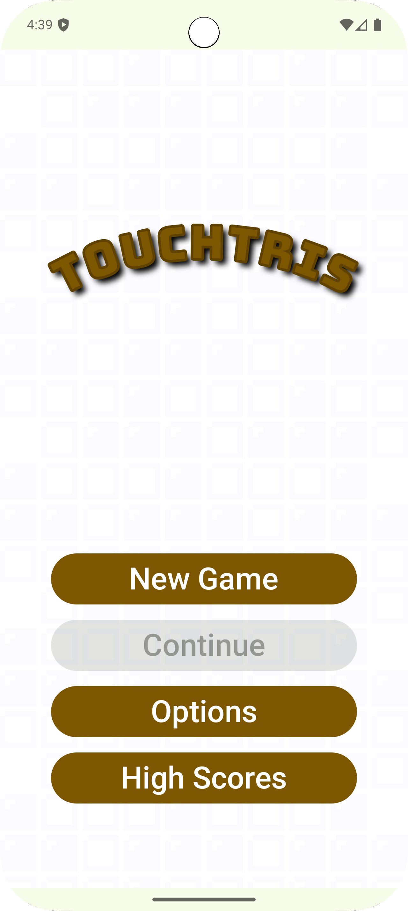

And supports landscape mode for lulz

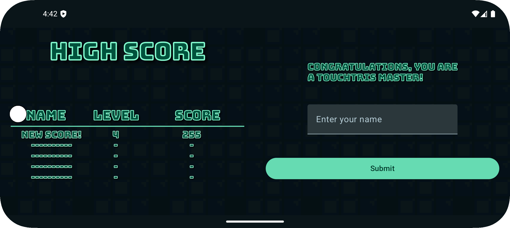
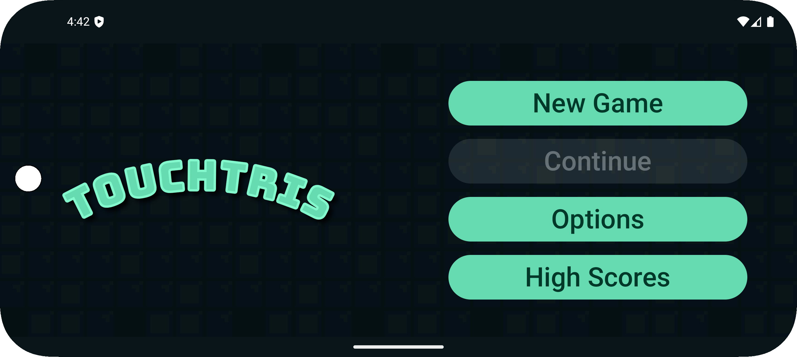
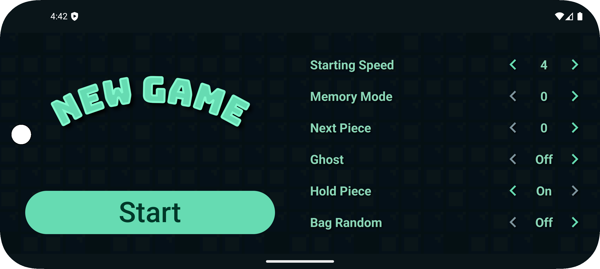
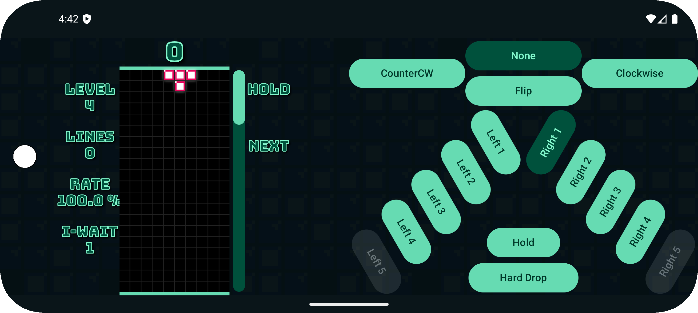
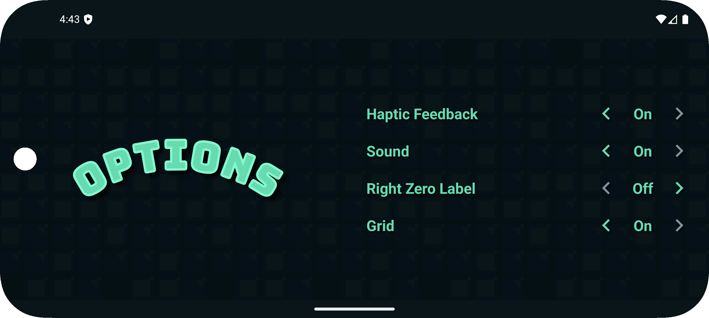
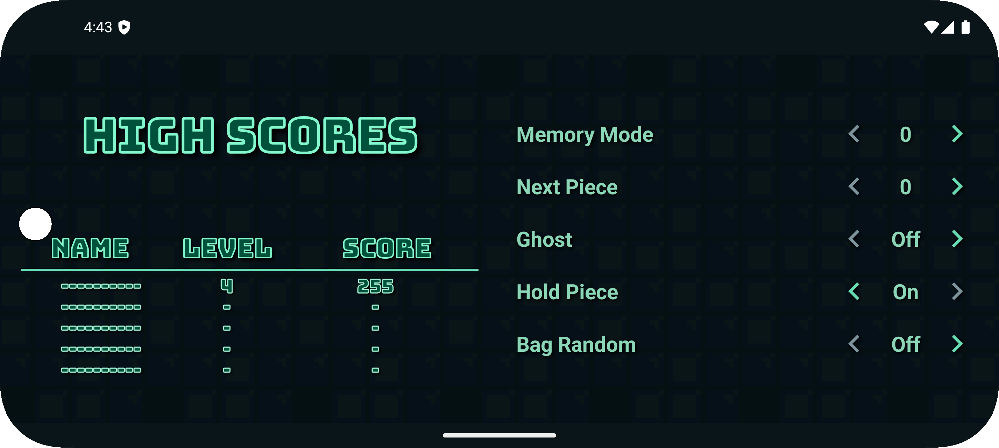

#### License
[Licensed  with GPLv3](https://www.gnu.org/licenses/gpl-3.0.en.html)
